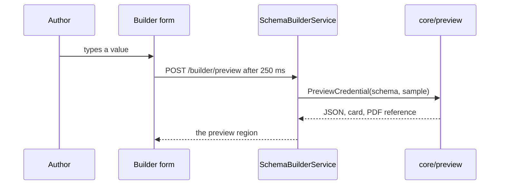

# Schema builder

This page describes the `schema-builder-ui` service (ADR-014). The service
README at [`services/schema-builder-ui/README.md`](../services/schema-builder-ui/README.md)
says how to run it. This page says how it works.

## The draft model

The builder keeps one `Draft` per page. A draft is pure data. It holds
the credential identity, the wallet card style, and the fields
(ADR-014 decision 2).

| Field | Meaning |
|---|---|
| `ID` | The schema id. It is empty for a schema the registry never saw. |
| `Type` | The credential type, which is the SD-JWT VC `vct`. |
| `Title` | The display name of the credential. |
| `Description` | The one sentence description under the name. |
| `Locale` | The BCP 47 tag of the display entry. |
| `LogoURI` | The logo of the wallet card. |
| `BackgroundColor` | The card background as a CSS hex value. |
| `TextColor` | The card text colour as a CSS hex value. |
| `Wire` | The wire formats the issuer offers. The first is the default. |
| `Expires` | True when the credential carries a validity window. |
| `Fields` | The claims in display order. |

Each field holds a name, a label, a help text, and a type. It also holds
a format, an enum list, a required flag, and a selective disclosure flag.

`Draft.Document` writes the JSON Schema 2020-12 document. It keeps the
field order. The preview and the registry pages then show the claims in
the order the author chose. `Draft.Problems` returns the sentences that
stop a save, for example a name that is not valid.

## The live view

The form carries `hx-trigger="input changed delay:250ms"`, so htmx waits
250 milliseconds after the last keystroke (ADR-014 decision 1). The
response replaces the region with the id `preview`. That region carries
`aria-live="polite"`, so a screen reader reads the new preview without a
focus move (ADR-014 decision 4).

The live view holds three tabs (ADR-014 decision 3).

| Tab | Content |
|---|---|
| Sample credential JSON | The sample credential in the selected wire format. |
| Wallet card | The title, the description, and the claim rows from the OID4VCI display metadata. |
| PDF preview | The reference and a link to the PDF document (ADR-016). |

A tab button is a disclosure button. It carries `aria-controls` and
`aria-expanded`, so it works with the keyboard and with a screen reader.
The preview logic lives in `core/preview`, which is a pure package with
no browser and no network.

The PDF document does not travel in the page. `PreviewCredential` returns
a reference, which is the first 16 bytes of the SHA-256 of the credential.
The service keeps the document in a small cache and serves it at
`GET /pdf/preview/{ref}`. The cache holds a fixed number of documents.
The oldest document leaves when the cache is full.

## Save and import

Save builds the registry message from the draft. It calls `Create` for a
new schema. It calls `Update` for a schema that already has an id. Both
calls make a `draft` version. No DPG learns about the schema until staff
publish the version in the schema registry (ADR-014 decision 5).

Import has two sources (ADR-014 decision 6).

| Source | Behaviour |
|---|---|
| A JSON Schema 2020-12 document | The builder maps the title, the properties, the types, the formats, the enums, and the required flags. |
| A DPG catalogue entry | The builder reads `CatalogBackendService.ListCredentialTypes` and maps the entry, with its display metadata and its selective disclosure flags. |

The import returns a warning for every part it cannot keep, for example
`minLength` or an array property. The page shows each warning as a toast.
The import opens the draft in the builder. The author checks it, then
saves it.

## Pages

The pages live under the configured prefix, `/builder` by default. Every
page renders with the `vca/ui` kit and passes `a11ytest.AssertPage`.

| Path | Page |
|---|---|
| `GET /builder/` | The builder. The query value `id` opens a stored version. |
| `POST /builder/preview` | The live preview region. |
| `POST /builder/fields` | Add or remove one field, then render the page again. |
| `POST /builder/sample` | Fill the sample values from the schema. |
| `POST /builder/save` | Save the draft in the schema registry. |
| `GET /builder/import` | The import page. |
| `POST /builder/import` | Import a document or a catalogue entry. |
| `GET /pdf/preview/{ref}` | The PDF preview document. |

Add, remove, fill, and save are submit buttons with a `formaction`
attribute. A browser without JavaScript posts the form and gets a full
page. With htmx the live preview is the only partial swap, so the pages
degrade to plain HTML.

Every flag is a select with `No` and `Yes`, not a checkbox. A select
keeps its value on every post and reads well with a screen reader.

## Packages

| Package | Role |
|---|---|
| `internal/draft` | The pure draft model, the JSON Schema writer, the form reader, and the importers. |
| `internal/wire` | The conversions between the draft, the preview input, and the registry message. |
| `internal/pdfcache` | The cache of the PDF preview documents and its handler. |
| `internal/service` | The `SchemaBuilderService` handler. |
| `internal/pages` | The builder pages and the import page. |
| `internal/fake` | The test doubles of the registry client and the catalogue client. |
| `internal/config` | The environment settings. |
| `internal/serve` | The h2c server with `/healthz` and `/readyz`. |
| `internal/app` | The wiring of every part. |

## Reference

- ADR-014 in [`adr.md`](adr.md).
- The proto: [`proto/vca/schemabuilder/v1/schemabuilder.proto`](../proto/vca/schemabuilder/v1/schemabuilder.proto).
- The schema registry: [`schema-registry.md`](schema-registry.md).
- The UI kit: [`ui.md`](ui.md).
