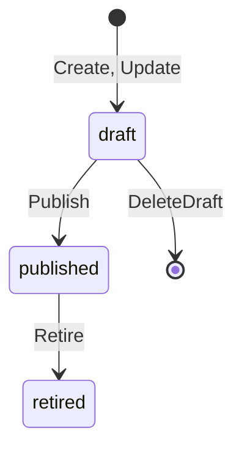

# Schema registry

This page describes the `schema-registry` service (ADR-013). The service
README at [`services/schema-registry/README.md`](../services/schema-registry/README.md)
says how to run it. This page says how it works.

## Data model

The service keeps one record per schema version (ADR-013 decisions 1 and 2).
A record never changes after the store writes it, except for its state.

| Field | Meaning |
|---|---|
| `id` | The schema id. It stays the same across versions. |
| `version` | The version number. It starts at 1 and grows by 1. |
| `type` | The credential type. The VCDM type name or the SD-JWT VC `vct`. |
| `json_schema` | The JSON Schema 2020-12 document, as a string. |
| `state` | `draft`, `published`, or `retired`. |
| `display` | The OID4VCI display metadata, one entry per locale. |
| `sd_claims` | The property names the holder can disclose one by one. |
| `formats` | The wire formats the issuer offers this schema in. |
| `expires` | True when credentials of this schema carry a validity window. |
| `searchable_claims` | The property names the issued credentials log indexes (ADR-017 decision 2). |
| `retention_days` | How long an issued record stays. Zero means the deployment default. |
| `configuration_ids` | The DPG configuration id per format, set at publish time. |
| `contexts` | The JSON-LD context IRIs that extend the VCDM 2.0 context. |
| `claim_mappings` | Per claim: the term IRI and the labels per locale. |

The service checks the contexts and the claim mappings before it stores
a version. Each context is an absolute http or https IRI with a host,
named once, and never the VCDM 2.0 context itself. Each mapped claim is
a property of the document. Each term IRI is absolute. Each label has a
language tag and a text, one per language. A broken rule gives
`invalid_argument`.

The store validates every record before it writes it. It parses the JSON
Schema with `core/jsonschema`. It rejects a selectively disclosable claim
or a searchable claim that is not a property of the document.

## Life cycle

`Update` never changes a version. It writes the next version as a draft.
`Publish` calls `RegisterCredentialConfiguration` on the issuer backend
once per format (ADR-013 decision 3). The DPG returns the configuration
id it stores. The record keeps that id. When the backend fails, the state
does not change and the RPC returns `unavailable`.

`Retire` with version zero retires every published version of the schema.
Issuance with a retired version stops. Verifiers can still read it.

`DeleteDraft` removes one draft version. Version zero selects the latest
draft. A published version gives `failed_precondition` with the sentence
"Retire a published version." A retired version stays, so verifiers can
read it. When the draft is the only version, the schema goes too.

## Public documents

The public endpoints are plain `net/http` handlers, not RPCs
(ADR-003 decision 7). The `metadata` package builds every document with
pure functions, so the RPCs and the HTTP handlers cannot diverge.

| Path | Document | Content type |
|---|---|---|
| `GET /api/schemas` | The published schemas with their URLs and configuration ids. | `application/json` |
| `GET /.well-known/openid-credential-issuer` | The OID4VCI 1.0 issuer metadata. | `application/json` |
| `GET /.well-known/vct/{vct}` | The SD-JWT VC type metadata of one schema. | `application/vnd.ietf.sd-jwt-vc-type-metadata+json` |
| `GET /vct/{vct}` | An alias of the type metadata. | the same |
| `GET /schemas/{id}/{version}` | One JSON Schema document with `$id`. | `application/schema+json` |

Every response carries an `ETag` and a `Cache-Control` header. A request
with a matching `If-None-Match` header gets `304 Not Modified`. The ETag
is the SHA-256 of the body. A document that did not change keeps its tag
across restarts.

### Issuer metadata

Each published version produces one `credential_configurations_supported`
entry per format (ADR-013 decision 4). The entry key is the configuration
id the DPG returned, or the derived id when there is no DPG. The entry
carries `format`, `scope`, the binding methods, and the signing
algorithms. It also carries the display metadata and the claims with
their `mandatory` flag. The `credential_metadata.schema_uri` field points
at the version document. An SD-JWT VC entry carries `vct`. An mdoc entry
carries `doctype`. A VCDM entry carries `credential_definition`. The
`@context` of an `ldp_vc` entry holds the VCDM 2.0 context, then each
context extension in order. When a claim maps to a term IRI, one object
with the term of each such claim comes last. The claim display of an
entry takes the labels of the claim mapping, when the claim has one.

### Type metadata

The type metadata document of a schema carries the `vct`, the name, and
the description (ADR-013 decision 5). It also carries the schema
document, the display entries with their rendering, and one claim entry
per property. A claim
the issuer marks as selectively disclosable has `sd: allowed`. Every
other claim has `sd: never`. The display of a claim takes the labels of
its mapping, one entry per language. A claim with no mapping shows the
title of its property.

The `vct` of a schema is the type when the type is a URL. It is the
registry URL `<base>/.well-known/vct/<type>` otherwise.

## Portal pages

The staff pages live under the configured prefix, `/portal` by default
(ADR-013 decision 6). Every page renders with the `vca/ui` kit and passes
`a11ytest.AssertPage`. Every page needs a session of `issuer-auth`
(ADR-036 decision 3). `VCA_SCHEMA_AUTH_JWKS_URL` names the key set and
`VCA_SCHEMA_LOGIN_URL` names the sign in chooser. The public documents
and the JSON listing stay open. The pages draw inside the issuer shell
of `services/internal/staffshell` (ADR-044 decision 5).
`POST /portal/signout` ends the session at `issuer-auth`.

| Path | Page |
|---|---|
| `GET /portal/` | The list with a search box, a status filter, a format filter, and the row actions. |
| `GET /portal/publish` | The publish from a file form. |
| `POST /portal/publish` | Store an uploaded JSON Schema document as version 1, then publish it when the form asks. |
| `GET /portal/schemas/{id}` | The detail of one version, with its claims, its display, its document, and its actions. |
| `GET /portal/schemas/{id}/versions` | The version history, newest first. |
| `POST /portal/schemas/{id}/publish` | Publish one draft version. |
| `POST /portal/schemas/{id}/retire` | Retire one or every published version. |
| `POST /portal/schemas/{id}/delete` | Delete one draft version. |
| `GET /portal/schemas/{id}/mapping` | The context extensions and the claim mapping of one version. |
| `POST /portal/schemas/{id}/mapping` | Check the mapping and save it as the next draft version. |

Each row shows the schema, its id, the version, and the formats. It
also shows the status, the issued count, and the last change. The row actions follow
the state. Every row opens the schema builder for
a new version. A draft deletes. A published version links to the issue
page with `?schema=<id>` and to its retire form. The issued count comes
from `IssuedService.List` of `issued-credentials` with the schema filter,
through `VCA_SCHEMA_ISSUED_URL`. The call names the staff member in the
actor header. The column shows a dash when the service does not answer.

The mapping page shows the VCDM 2.0 context and a box of context IRIs,
one per line. Each claim gets a term IRI and a label and a description
per display language. A save writes the next draft version, because a
version never changes. A field that breaks a rule shows the reason next
to it, and no version appears.

The upload reads one JSON Schema file of 256 KiB or less. An empty type
takes the title of the document with each word capitalised and joined.
An empty display name takes the title.

The publish target follows the probe of the peers (ADR-034 decision 5).
A publish registers the version with the adapter of the own pair. The
form offers only the formats that adapter lists. It offers publish only
when the adapter lists `FEATURE_CREDENTIAL_CONFIG_API`. Otherwise the
upload stays a draft. The page also names the other live stacks that
take schemas. Each link opens the publish page of that stack. The detail
page of a draft hides the publish form in three cases. The stack takes
no schema, is not ready, or does not issue a format of the version.

The display block of the detail lists the display entries of the
version. For a published version it also shows the card templates of
the stack. The page asks `GetIssuerMetadata` of the adapter of the
pair. It shows each render template of a configuration of the same
type. The SVG goes in as an image from a data URL. No
script of the stack runs in the page. A template above 256 KiB stays
out. A failed call shows the display entries only.

Every page reads through a `SchemaService` client. The in-process service
satisfies that client, so a page cannot see a state the API does not
serve. An action posts a form, calls the RPC, and redirects to the detail
page with a notice code. The notice code selects a fixed sentence, so a
query value can never reach the page as text.

## Packages

| Package | Role |
|---|---|
| `internal/record` | The canonical version, its validation, its life cycle rules, and the proto conversion. |
| `internal/store` | The versioned store over the shared store document. |
| `internal/metadata` | The pure builders of every public document. |
| `internal/service` | The `SchemaService` handler. |
| `internal/httpapi` | The public HTTP endpoints with the cache headers. |
| `internal/portal` | The staff pages. |
| `internal/config` | The environment settings, read with the shared config package. |
| `internal/app` | The wiring of every part. |

## Reference

- ADR-013 in [`adr.md`](adr.md).
- The proto: [`proto/vca/schema/v1/schema.proto`](../proto/vca/schema/v1/schema.proto).
- The schema builder: [`schema-builder-ui.md`](schema-builder-ui.md).
