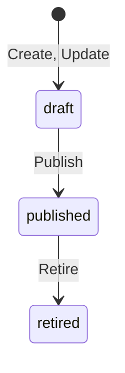

# Schema registry

This page describes the `schema-registry` service (ADR-013). The service
README at [`services/schema-registry/README.md`](../services/schema-registry/README.md)
says how to run it. This page says how it works.

## Data model

The service keeps one record per schema version (ADR-013 decisions 1 and 2).
A record never changes after the store writes it, except for its state.

| Field | Meaning |
|---|---|
| `id` | The schema id. It stays the same across versions. |
| `version` | The version number. It starts at 1 and grows by 1. |
| `type` | The credential type. The VCDM type name or the SD-JWT VC `vct`. |
| `json_schema` | The JSON Schema 2020-12 document, as a string. |
| `state` | `draft`, `published`, or `retired`. |
| `display` | The OID4VCI display metadata, one entry per locale. |
| `sd_claims` | The property names the holder can disclose one by one. |
| `formats` | The wire formats the issuer offers this schema in. |
| `expires` | True when credentials of this schema carry a validity window. |
| `searchable_claims` | The property names the issued credentials log indexes (ADR-017 decision 2). |
| `retention_days` | How long an issued record stays. Zero means the deployment default. |
| `configuration_ids` | The DPG configuration id per format, set at publish time. |

The store validates every record before it writes it. It parses the JSON
Schema with `core/jsonschema`. It rejects a selectively disclosable claim
or a searchable claim that is not a property of the document.

## Life cycle

`Update` never changes a version. It writes the next version as a draft.
`Publish` calls `RegisterCredentialConfiguration` on the issuer backend
once per format (ADR-013 decision 3). The DPG returns the configuration
id it stores. The record keeps that id. When the backend fails, the state
does not change and the RPC returns `unavailable`.

`Retire` with version zero retires every published version of the schema.
Issuance with a retired version stops. Verifiers can still read it.

## Public documents

The public endpoints are plain `net/http` handlers, not RPCs
(ADR-003 decision 7). The `metadata` package builds every document with
pure functions, so the RPCs and the HTTP handlers cannot diverge.

| Path | Document | Content type |
|---|---|---|
| `GET /api/schemas` | The published schemas with their URLs and configuration ids. | `application/json` |
| `GET /.well-known/openid-credential-issuer` | The OID4VCI 1.0 issuer metadata. | `application/json` |
| `GET /.well-known/vct/{vct}` | The SD-JWT VC type metadata of one schema. | `application/vnd.ietf.sd-jwt-vc-type-metadata+json` |
| `GET /vct/{vct}` | An alias of the type metadata. | the same |
| `GET /schemas/{id}/{version}` | One JSON Schema document with `$id`. | `application/schema+json` |

Every response carries an `ETag` and a `Cache-Control` header. A request
with a matching `If-None-Match` header gets `304 Not Modified`. The ETag
is the SHA-256 of the body. A document that did not change keeps its tag
across restarts.

### Issuer metadata

Each published version produces one `credential_configurations_supported`
entry per format (ADR-013 decision 4). The entry key is the configuration
id the DPG returned, or the derived id when there is no DPG. The entry
carries `format`, `scope`, the binding methods, and the signing
algorithms. It also carries the display metadata and the claims with
their `mandatory` flag. The `credential_metadata.schema_uri` field points
at the version document. An SD-JWT VC entry carries `vct`. An mdoc entry
carries `doctype`. A VCDM entry carries `credential_definition`.

### Type metadata

The type metadata document of a schema carries the `vct`, the name, and
the description (ADR-013 decision 5). It also carries the schema
document, the display entries with their rendering, and one claim entry
per property. A claim
the issuer marks as selectively disclosable has `sd: allowed`. Every
other claim has `sd: never`.

The `vct` of a schema is the type when the type is a URL. It is the
registry URL `<base>/.well-known/vct/<type>` otherwise.

## Portal pages

The staff pages live under the configured prefix, `/portal` by default
(ADR-013 decision 6). Every page renders with the `vca/ui` kit and passes
`a11ytest.AssertPage`. Every page needs a session of `issuer-auth`
(ADR-036 decision 3). `VCA_SCHEMA_AUTH_JWKS_URL` names the key set and
`VCA_SCHEMA_LOGIN_URL` names the sign in chooser. The public documents
and the JSON listing stay open.

| Path | Page |
|---|---|
| `GET /portal/` | The list with a search box, a state filter, and a format filter. |
| `GET /portal/schemas/{id}` | The detail of one version, with its claims, its document, and its actions. |
| `GET /portal/schemas/{id}/versions` | The version history, newest first. |
| `POST /portal/schemas/{id}/publish` | Publish one draft version. |
| `POST /portal/schemas/{id}/retire` | Retire one or every published version. |

Every page reads through a `SchemaService` client. The in-process service
satisfies that client, so a page cannot see a state the API does not
serve. An action posts a form, calls the RPC, and redirects to the detail
page with a notice code. The notice code selects a fixed sentence, so a
query value can never reach the page as text.

## Packages

| Package | Role |
|---|---|
| `internal/record` | The canonical version, its validation, its life cycle rules, and the proto conversion. |
| `internal/store` | The versioned store over the shared store document. |
| `internal/metadata` | The pure builders of every public document. |
| `internal/service` | The `SchemaService` handler. |
| `internal/httpapi` | The public HTTP endpoints with the cache headers. |
| `internal/portal` | The staff pages. |
| `internal/config` | The environment settings, read with the shared config package. |
| `internal/app` | The wiring of every part. |

## Reference

- ADR-013 in [`adr.md`](adr.md).
- The proto: [`proto/vca/schema/v1/schema.proto`](../proto/vca/schema/v1/schema.proto).
- The schema builder: [`schema-builder-ui.md`](schema-builder-ui.md).
